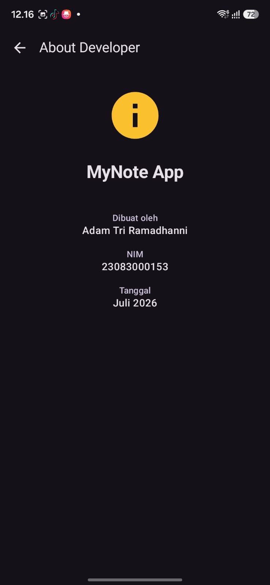
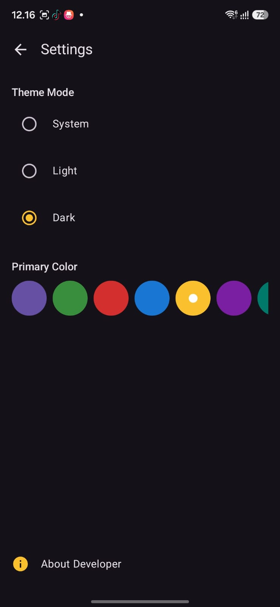

## Download APK

File APK aplikasi MyNote tersedia pada halaman Releases repository GitHub.

Silakan unduh melalui tautan berikut:

- https://github.com/adamtri10/UAS-Pemmob-My-Note-APP/releases/tag/MyNotev1.0

## Screenshot 

# 📱 My Note App

## 📖 About

  

---

## 📝 Buat Note

  

---

## ✅ Contoh Hasil Note yang Selesai

  

---

## 📌 Fitur Pin

  

---

## 🔍 Fitur Search

  

---

## 🕒 Perubahan Terakhir Tercatat

  

---

## ⚙️ Settings

  

